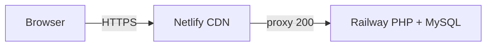

# Netlify + Railway hybrid hosting

School e-Café is a PHP + MySQL app and **cannot run natively on Netlify**. The supported approach is a **hybrid setup**:

- **Railway** — runs the PHP app, MySQL, and file storage
- **Netlify** — public URL and reverse proxy to Railway



## Prerequisites

- Railway backend deployed ([Deploy to Railway](../README.md#deploy-to-railway))
- Netlify account
- Railway CLI: `npm install -g @railway/cli`
- Netlify CLI (optional): `npm install -g netlify-cli`

## Quick setup

```powershell
# 1. Railway backend + database
railway login
railway link
.\scripts\setup-railway-live.ps1

# 2. Full hybrid wizard (pass your URLs when known)
.\scripts\setup-netlify-hybrid.ps1 `
  -RailwayBackendUrl "https://your-app.up.railway.app" `
  -NetlifyDomain "https://your-site.netlify.app"
```

## Step 1: Deploy Netlify proxy site

The [`netlify-proxy/`](../netlify-proxy/) folder is a minimal Netlify site that proxies all traffic to Railway.

### Option A — GitHub (recommended)

1. Netlify → **Add new site** → **Import from Git**
2. Select the `ecafe` repo
3. **Base directory:** `netlify-proxy`
4. **Build command:** `node scripts/generate-redirects.js` (set in `netlify.toml`)
5. **Publish directory:** `public`
6. Add environment variable:
   - `RAILWAY_BACKEND_URL` = `https://your-app.up.railway.app` (no trailing slash)
7. Deploy

### Option B — Netlify CLI

```bash
cd netlify-proxy
cp .env.example .env   # set RAILWAY_BACKEND_URL locally for testing
npm install -g netlify-cli
netlify login
netlify init
netlify deploy --prod
```

Set `RAILWAY_BACKEND_URL` in the Netlify dashboard before deploying.

## Step 2: Custom domain DNS

1. Netlify → **Domain management** → **Add domain**
2. At your registrar, point DNS to Netlify:
   - **CNAME** `www` → `<your-site>.netlify.app`, or
   - Use **Netlify DNS** (change nameservers)
3. Wait for SSL certificate provisioning
4. Verify DNS:

```powershell
.\scripts\verify-netlify-dns.ps1 -Domain yourdomain.com
```

## Step 3: Update Railway environment variables

Point the PHP app at your **Netlify** URL (not the Railway subdomain):

```powershell
.\scripts\update-railway-netlify-urls.ps1 -NetlifyDomain "https://yourdomain.com"
```

This sets:

- `APP_URL=https://yourdomain.com`
- `MPESA_CALLBACK_URL=https://yourdomain.com/api/mpesa/callback`

## Step 4: Smoke test

```powershell
.\scripts\test-hybrid-deploy.ps1 `
  -NetlifyUrl "https://yourdomain.com" `
  -RailwayUrl "https://your-app.up.railway.app"
```

Manual checks:

- Login: `STU001` / `Password123!`
- Place a test order → QR code generated
- Redeploy Netlify → QR codes still work (Railway volumes)

## How the proxy works

At build time, [`netlify-proxy/scripts/generate-redirects.js`](../netlify-proxy/scripts/generate-redirects.js) writes `public/_redirects`:

```
/*  https://your-app.up.railway.app/:splat  200
```

Netlify serves this as a reverse proxy — the browser sees your Netlify domain; PHP runs on Railway.

## Troubleshooting

| Issue | Fix |
|-------|-----|
| Netlify shows fallback HTML | `RAILWAY_BACKEND_URL` not set or build failed — check Netlify deploy logs |
| Login redirects to Railway URL | Run `update-railway-netlify-urls.ps1` with your Netlify domain |
| M-Pesa callback fails | Set `MPESA_CALLBACK_URL` to Netlify domain; update Daraja app settings |
| 502 from Netlify | Railway app down or wrong `RAILWAY_BACKEND_URL` |

## Files

| Path | Purpose |
|------|---------|
| `netlify-proxy/netlify.toml` | Netlify build and publish config |
| `netlify-proxy/scripts/generate-redirects.js` | Build-time proxy rule generator |
| `scripts/setup-railway-live.ps1` | Railway deploy + DB init |
| `scripts/setup-netlify-hybrid.ps1` | End-to-end setup wizard |
| `scripts/update-railway-netlify-urls.ps1` | Sync Railway URLs to Netlify domain |
| `scripts/verify-netlify-dns.ps1` | DNS verification helper |
| `scripts/test-hybrid-deploy.ps1` | Automated smoke tests |
